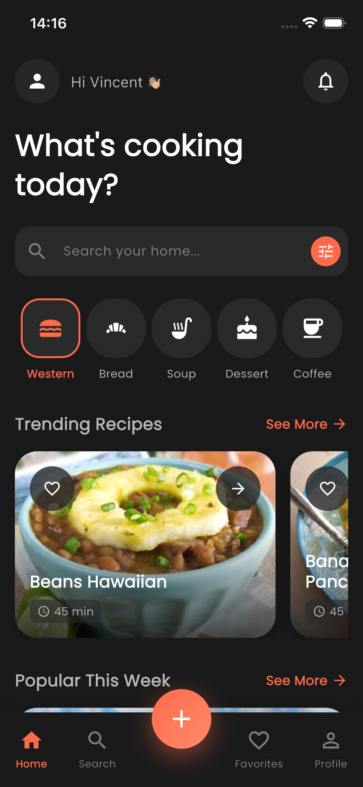
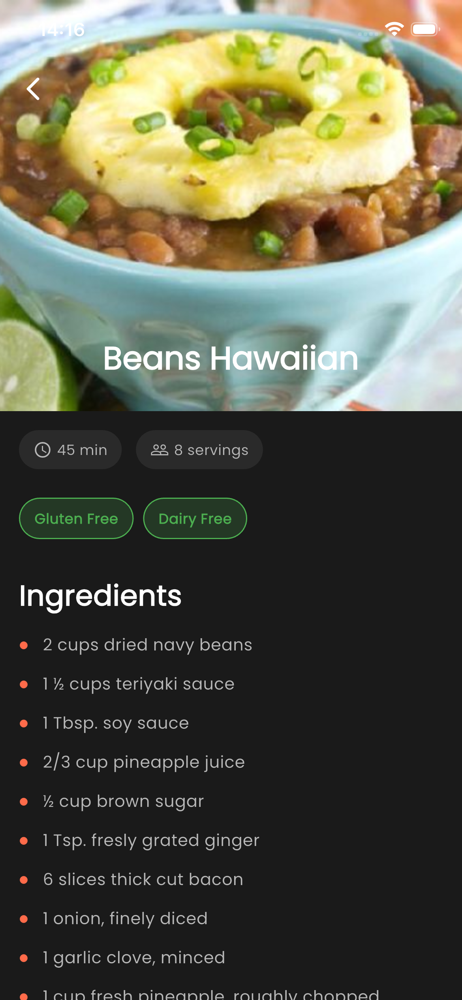
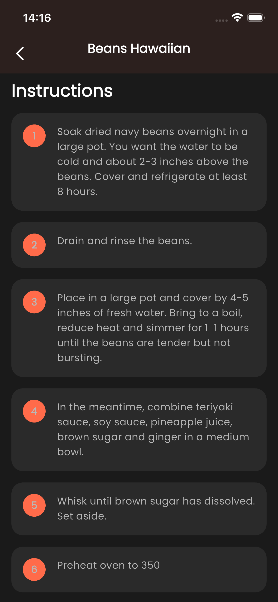
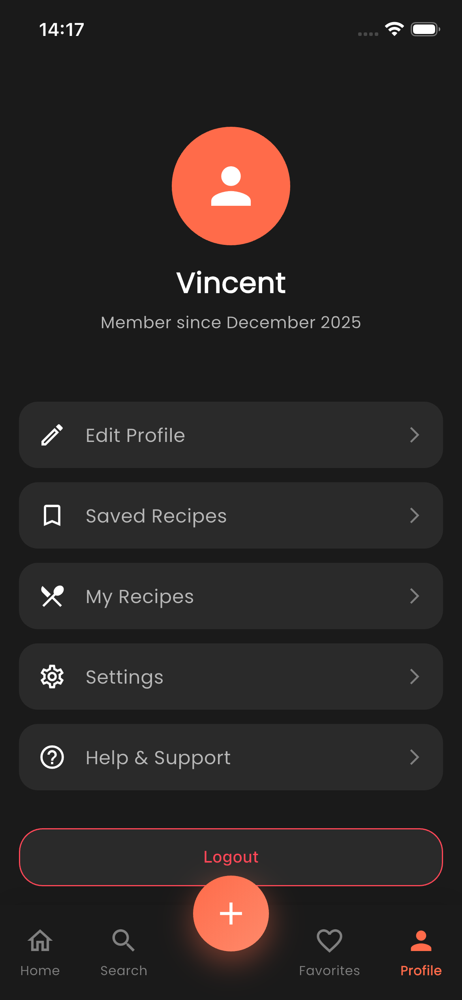

# Recipe App 🍳(Still in the making)

A modern, feature-rich recipe application built with Flutter that helps users discover, organize, and create meals based on their preferences and available ingredients.

## Overview

Recipe App is your personal cooking companion that makes meal planning effortless. Whether you're looking for inspiration, trying to use up ingredients in your fridge, or following a specific diet plan, this app has you covered.

## Features

### Core Functionality
- **Recipe Search**: Quickly find recipes by name, ingredient, or cuisine type
- **Smart Recipe Generation**: Get personalized recipe suggestions based on ingredients you have in your fridge
- **Meal Planning**: Receive customized meal plans tailored to specific dietary requirements (vegan, keto, gluten-free, etc.)
- **Favorites**: Save your favorite recipes for quick access

- ## Users will be able to:

- Import recipes from any social media platform 
- Add their own recipes 
- Get random recipes 
- Search recipes by (name, ingredients, etc)
- Have a personalised home feed
- Add recipes to favorite 

### Home Screen
- Personalized greeting with user avatar
- Quick search bar for instant recipe lookup
- Recipe categories with intuitive icon navigation
- Trending recipes carousel showcasing popular dishes
- Popular recipes feed with detailed cards

### Recipe Details
Each recipe includes:
- High-quality food photography
- Recipe title and description
- Serving size information
- Preparation and cooking time
- Complete ingredient list
- Step-by-step cooking instructions

### User Profile
- Profile avatar customization
- User information display
- Membership date tracking
- Secure logout functionality

## Tech Stack

- **Frontend**: Flutter (Dart)
- **Backend**: Firebase
  - Firestore for real-time database
  - Firebase Authentication for user management
  - Firebase Storage for image hosting

## Screenshots

## Screenshots

<div align="center">
  
  
  
  
  
  
  
</div>

## Getting Started

### Prerequisites
- Flutter SDK (latest stable version)
- Dart SDK
- Firebase account
- Android Studio / VS Code with Flutter extensions

### Installation

1. Clone the repository
```bash
git clone https://github.com/yourusername/recipe-app.git
cd recipe-app
```

2. Install dependencies
```bash
flutter pub get
```

3. Configure Firebase
   - Create a new Firebase project at [Firebase Console](https://console.firebase.google.com/)
   - Add your Android/iOS app to the Firebase project
   - Download and add `google-services.json` (Android) and `GoogleService-Info.plist` (iOS)
   - Enable Firestore Database and Authentication in Firebase Console

4. Run the app
```bash
flutter run
```

## Project Structure

```
lib/
├── main.dart
├── screens/
│   ├── home_screen.dart
│   ├── search_screen.dart
│   ├── favorites_screen.dart
│   ├── profile_screen.dart
│   └── recipe_detail_screen.dart
├── widgets/
│   ├── recipe_card.dart
│   ├── category_item.dart
│   └── bottom_navbar.dart
├── models/
│   ├── recipe.dart
│   └── user.dart
└── services/
    ├── firebase_service.dart
    └── recipe_service.dart
```
